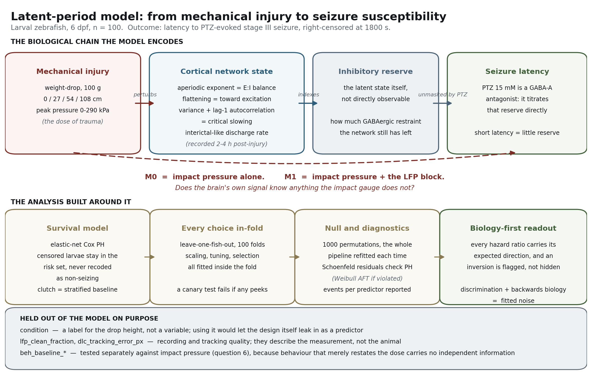
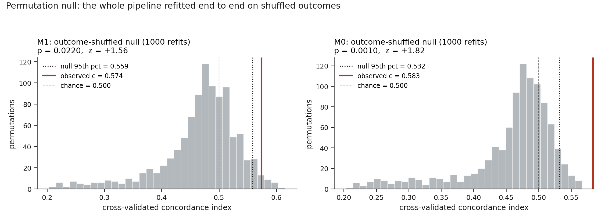

# Does the injured brain tell you when it will seize?

**Predicting latency to PTZ-evoked seizure after graded mechanical brain injury in larval zebrafish, using local field potential markers of excitation–inhibition balance and critical slowing.**

---

## 1. The problem: a window we can see but cannot read

Traumatic brain injury is one of the few causes of epilepsy where we know the exact moment the disease process begins. Somebody is hit on the head on a Tuesday; if they develop post-traumatic epilepsy, the first unprovoked seizure typically arrives months or years later. Between the injury and the first seizure lies the **latent period** — an interval in which the brain is not epileptic yet but is becoming so.

That interval is the most valuable therapeutic window in all of epilepsy. It is the only period in which an anti-epileptogenic drug — one that prevents the disease rather than suppressing its symptoms — could plausibly be given. Every major clinical trial of prophylaxis after TBI has failed, and one reason is brutally simple: **we cannot tell, at the time of injury, which brains are epileptogenic.** Trials dose everybody, most of whom were never going to develop epilepsy, and the treatment effect drowns.

Injury severity is the standard triage variable, and it is a weak one. Two people can sustain the same measured impact and take entirely different courses — one recovers, one develops refractory epilepsy. That divergence is the clinical fact this project is built around. Something other than the size of the blow determines who becomes epileptic, and that something ought to be visible in how the injured network is behaving.

So the question here is narrow and testable:

> **Does the brain's own electrophysiological signal, recorded hours after injury, tell you anything about seizure susceptibility that the impact gauge does not already tell you?**

## 2. The preparation: why larval zebrafish

Larval zebrafish at 6 days post-fertilisation are a workhorse preparation for epilepsy research for reasons that matter here. They are transparent, so the brain can be recorded and imaged without surgery. They have a conserved vertebrate forebrain with functioning GABAergic and glutamatergic systems. Above all, their seizure behaviour is stereotyped and scorable on a scale that has been used for two decades: **Baraban's stages I–III**, where stage I is increased swimming, stage II is rapid whirlpool-like circling, and **stage III is the loss of posture with a whole-body clonus-like convulsion** — the unambiguous endpoint used in this study.

The cohort here is 100 larvae. Injury is delivered by a calibrated weight drop (100 g) from one of four heights — 0 cm (sham), 27, 54, and 108 cm — producing peak impact pressures spanning 0 to 290 kPa. Twenty-five larvae per level, five clutches, fully crossed and balanced, with blinded scoring.

## 3. Why latency to seizure is a measurement of inhibitory reserve

This is the conceptual centre of the study, and it is worth being precise about.

**Pentylenetetrazol (PTZ) is a GABA-A receptor antagonist.** It does not "cause" a seizure in any interesting sense; it removes inhibition, progressively, at a fixed rate. Every larva in this experiment receives the same dose (15 mM) in the same volume at the same developmental stage. What differs between larvae is not the challenge — it is how much GABAergic restraint each brain had in reserve when the challenge began.

That reframes the outcome variable completely. **Latency to stage III is not a behavioural score. It is a titration.** A larva whose inhibitory tone is already eroded has less to lose and crosses into generalised seizure early. A larva with intact inhibitory reserve absorbs the antagonist for longer. The seconds on the clock are a readout of a latent physiological quantity — remaining inhibitory reserve — that cannot be measured directly.

This is why the analysis is a **survival model** and not a classifier. The quantity of interest is *when* the network gives way under a controlled inhibitory load, and "when" is exactly what survival analysis is built to model. Thirteen of the 100 larvae never reached stage III within the 30-minute observation window. Those animals are not failures and they are not negatives — **they are the larvae with the most inhibitory reserve in the entire cohort**, and they carry more information about resilience than anything else in the dataset. A classifier that labelled them "did not seize" would throw that away and, worse, would treat the arbitrary length of the recording session as though it were a fact about the animal. They are right-censored: known to have survived past 1800 s, with the rest of their latency unobserved.

## 4. What the LFP features actually mean

The local field potential was recorded 2–4 hours after injury, well before any PTZ challenge. These are measurements of the resting injured network, not of the seizure itself. Three families of feature are used, and each rests on a distinct piece of neurophysiology.

### 4.1 The aperiodic exponent: excitation–inhibition balance

The power spectrum of a field potential is not just oscillatory peaks. Underneath the alpha, theta and gamma bumps lies a broadband `1/f`-like component, and its steepness — the **aperiodic exponent** — is not noise. Modelling and empirical work over the past decade has established that the slope of this component tracks the ratio of excitatory to inhibitory synaptic currents in the underlying population. The mechanism is a difference in synaptic time constants: **AMPA-mediated excitatory currents decay fast, GABA-A-mediated inhibitory currents decay slowly.** A population dominated by slow inhibitory currents produces a spectrum with more low-frequency power relative to high — a steep slope. Shift the balance toward excitation and the spectrum **flattens**.

So `lfp_ap_slope` is, to a first approximation, a non-invasive index of E:I balance. **A flatter slope means a network that has shifted toward excitation** — which, after a traumatic injury known to damage parvalbumin-positive interneurons preferentially, is precisely the direction pathology should push it.

This yields a hard directional prediction. Flattening means less inhibitory dominance, which means less reserve, which means a *shorter* latency to stage III. **The hazard ratio on `lfp_ap_slope` should be below 1.** `lfp_ap_offset` (the broadband vertical shift, related to population spike rate) and `lfp_ap_fit_error` (how well the aperiodic model actually fits) accompany it.

### 4.2 Critical slowing: variance and autocorrelation

The second family comes from dynamical systems rather than synaptic physiology. A system approaching a bifurcation — a tipping point where its stable state disappears — shows a characteristic signature before it tips. Its recovery from small perturbations gets slower. Two consequences follow, and they are mathematically linked rather than independently postulated:

- **Variance rises** (`lfp_variance_uV2`). Perturbations are not damped as quickly, so the system wanders further from equilibrium.
- **Lag-1 autocorrelation rises** (`lfp_autocorr_lag1`). The system's present state resembles its recent past more closely, because it is returning to baseline more sluggishly.

These are the canonical **early warning signals of critical transitions**, and a seizure is a plausible candidate for exactly such a transition — a network switching from an asynchronous stable regime into a hypersynchronous one. If an injured brain is drifting toward the seizure threshold during the latent period, both markers should rise, and both should predict *shorter* latency. **Both hazard ratios should be above 1.**

Because the two arise from the same underlying slowdown, they carry a built-in consistency check. If they move together, that is genuine evidence about network dynamics. If they disagree, at least one is tracking something else — electrode drift, a movement artifact, a filtering artifact — and the analysis should say so rather than average them.

### 4.3 Discharge rate and band power

`lfp_discharge_rate_per_min` counts interictal-like events: brief, high-amplitude paroxysmal deflections. In clinical epileptology, interictal discharges are the classic marker of an irritable cortex, and their appearance during the latent period after experimental TBI is one of the more reproducible findings in the rodent literature. **More discharges should mean a more excitable network and a shorter latency — hazard ratio above 1.**

The normalised band powers (`lfp_power_low_norm`, `lfp_power_mid_norm`, `lfp_power_high_norm`) describe the distribution of oscillatory power. One structural note that matters later: they sum to 1 by construction, so they are a **closed composition** and only two of the three are independent.

## 5. What was deliberately kept out of the model, and why

Several columns in the dataset are excluded on biological grounds, not statistical ones.

**`condition` is a label, not a variable.** It is a one-to-one renaming of drop height. Putting it in the model would let the experimental design enter as a predictor, and the model would learn to recognise the group rather than the animal. Drop height is used as a stratum — a thing to hold constant and predict *within* — never as a feature.

**`lfp_clean_fraction` and `dlc_tracking_error_px` are quality control.** They describe how good the recording and the video tracking were. A model that uses them is predicting the equipment, not the fish. They are reported as diagnostics and never enter a model.

**The behavioural baselines are treated as suspects, not predictors.** `beh_baseline_speed_mm_s`, `beh_baseline_immobile_frac`, and `beh_baseline_burst_rate_per_min` are all plausible susceptibility markers — but they are also downstream of the injury itself, and a feature that merely restates the dose in different units adds nothing while looking impressive. They are therefore tested directly against impact pressure (question 6) rather than fed into the survival model.

## 6. The model framework



The statistical machinery is chosen to serve the biology above, and every piece of it maps onto something in the preceding sections.

An **elastic-net regularised Cox proportional hazards model** is used because the outcome is a censored latency and because 11 correlated LFP features against 87 events is a regime where unpenalized estimates are unstable. The penalty is not shrinkage for its own sake: it is the mechanism that asks whether a feature earns its place. **Impact pressure is left unpenalized** so that the injury-dose term is guaranteed to survive — otherwise the comparison "does the brain signal add anything to the hit" could be won by deleting the hit.

**Clutch enters as a stratified baseline hazard.** Five clutches of siblings do not share a single baseline seizure threshold; genetic background and maternal contribution shift it. Stratification lets each clutch have its own baseline hazard function while sharing the covariate effects, which is exactly the biological claim being made. (A frailty term was requested; `lifelines` provides no gamma-frailty Cox model and refuses to combine `strata` with its cluster-robust estimator, so the variance correction is obtained by bootstrapping whole clutches instead — the resampling unit is the biological replicate, not the individual larva. The substitution is logged in `results.json`.)

**Every model choice is made inside the cross-validation fold.** Leave-one-fish-out, 100 folds; the scaler, the hyperparameter search, and the feature selection are all refitted from scratch on the 99 remaining larvae before the held-out one is scored. This is enforced, not asserted — `tests/test_leakage.py` corrupts the held-out larvae to absurd values and fails if a single training-fold constant moves, plus a second test that fails if that canary is vacuous.

**The null distribution is generated by refitting everything.** One thousand times, the (latency, event) pairs are shuffled across larvae — keeping each censored animal censored — and the entire pipeline is rebuilt end to end. This is the only honest reference for a concordance index computed under a tuned, selected model.

## 7. Results

Full numbers, with confidence intervals, seeds, and package versions, are in [`results/results.json`](results/results.json) and [`results/metrics.csv`](results/metrics.csv).

**Cohort.** 100 larvae, 87 reached stage III, 13 right-censored at 1800 s, no tied event times. Events per predictor for the full model is **7.91, below the threshold of 10** — flagged in the output. Individual hazard ratios are therefore directional evidence, not precise effect sizes.

### 7.1 Does the brain's signal add anything to the hit? — **No**

Cross-validated concordance is **0.583 (95% CI 0.518–0.651)** for impact pressure alone and **0.574 (0.522–0.628)** when the whole LFP block is added. The change is **−0.009 (95% CI −0.033 to +0.011)** — adding ten electrophysiological features makes the prediction very slightly *worse*. The nested likelihood ratio test agrees: χ²(9) = 13.33, **p = 0.148**.

The elastic net reached the same verdict independently and more bluntly. Across the 100 folds, impact pressure was retained **100 times out of 100**; the most frequently retained LFP feature, `lfp_ap_slope`, survived **16 times**, discharge rate 14, and everything else 8 or fewer. In the final model every LFP coefficient is shrunk to effectively zero, leaving pressure alone with a hazard ratio of **1.48 per SD (1.25–1.94)**.

### 7.1b The permutation null, and what it does and does not license



Both models beat their outcome-shuffled null, and — this is the part that matters — **the pressure-only model beats it more decisively than the model with the brain signal added:**

| | observed *c* | null mean | null 95th pct | *p* | *z* |
|---|---|---|---|---|---|
| **M0** (pressure only) | 0.583 | 0.458 | 0.532 | **0.0010** | +1.82 |
| **M1** (pressure + LFP) | 0.574 | 0.468 | 0.559 | **0.0220** | +1.56 |

Each of these 2000 null values is a complete rebuild — outcomes shuffled as (latency, event) pairs so censored larvae stay censored, then the scaler, the inner hyperparameter search, the elastic-net selection, and all 100 leave-one-fish-out folds refitted from scratch. Note that both null distributions centre **below** 0.5 (0.458 and 0.468) rather than on it. That is expected for a cross-validated concordance under a tuned, selected model and is exactly why a chance line at 0.500 is the wrong reference: judged against 0.5 the models look worse than they are, and judged against a null that ignored the tuning they would look better.

What this licenses is narrow. It says the association between predictors and latency is not an artifact of the fitting procedure. It says nothing about *which* association, and the sections below establish that the association being detected is the between-group injury contrast. **A permutation p-value of 0.022 and a within-stratum concordance of 0.413 are not in tension — they are the same result seen from two directions.** This is precisely why the permutation test was never going to be sufficient on its own.

### 7.2 Do the retained features point the right way? — **Half of them do not**

Because the penalty deleted the LFP block, the direction check falls back to the unpenalized sensitivity fit, and the result is the most biologically interesting thing in the study:

| Feature | Expected | Observed HR per SD (95% CI) | Verdict |
|---|---|---|---|
| `lfp_ap_slope` | HR < 1 | **0.46 (0.22–0.97)**, p = 0.042 | **as predicted** |
| `lfp_discharge_rate_per_min` | HR > 1 | 1.04 (0.70–1.55) | as predicted, negligible |
| `lfp_variance_uV2` | HR > 1 | **0.78 (0.56–1.09)** | **inverted** |
| `lfp_autocorr_lag1` | HR > 1 | **0.98 (0.59–1.63)** | **inverted** |

The aperiodic exponent behaves exactly as the E:I account predicts, and it is the only feature in the unpenalized fit whose confidence interval excludes 1 — impact pressure itself does not (HR 0.97, 0.65–1.45, p = 0.89, once the LFP block is in the model). **A one-SD flattening of the aperiodic slope is associated with roughly a doubling of seizure hazard.** The Weibull AFT sensitivity fit agrees independently (time ratio 1.81 per SD, p = 0.015 — a steeper slope buys 81% more time). This is a real, direction-correct, mechanistically coherent finding.

The critical slowing markers point backwards.

### 7.3 Do the two critical slowing features agree? — **Yes, and that is the problem**

`lfp_variance_uV2` (HR 0.78) and `lfp_autocorr_lag1` (HR 0.98) agree with each other in sign, and the two features are genuinely correlated across larvae (r = 0.67, Spearman ρ = 0.67, p = 2 × 10⁻¹⁴). They co-vary as the shared-slowdown mechanism says they should — **but both point away from seizure risk rather than toward it.**

Two mechanistically linked markers moving together *against* the prediction is not two independent failures; it is one shared cause. The most parsimonious reading is that in this cohort both are tracking something that rises with injury but is protective or irrelevant for seizure threshold — plausibly a post-traumatic shift toward slower, higher-amplitude, more strongly damped network activity, which raises variance and autocorrelation without moving the network closer to its seizure bifurcation. Critical slowing theory would need the network to be near a tipping point for these markers to mean what they are supposed to mean; nothing here establishes that it is.

### 7.4 Do two larvae that took the same hit differ predictably? — **No**

This is the question injury severity cannot answer, and it is the clinically important one. Holding drop height constant, within-stratum concordance is **0.413 pair-weighted, below chance**, and not one of the four strata has an interval excluding 0.5 (0 cm: 0.163; 27 cm: 0.528; 54 cm: 0.522; 108 cm: 0.430). Full independent refits within each stratum are reported in the JSON but rest on 19–25 events against up to 11 predictors (events per predictor 1.8–2.3) and are descriptive only.

### 7.5 Does predicted susceptibility follow the injury gradient? — **Yes, almost perfectly**

Mean predicted risk orders **Sham (−0.556) < TBI_27cm (−0.064) < TBI_54cm (+0.149) < TBI_108cm (+0.491)**, monotone as expected, with Spearman ρ = **0.947** between drop height and predicted risk (p = 4 × 10⁻⁵⁰).

**Sections 7.4 and 7.5 read together are the finding of this study.** The model reproduces the injury gradient almost perfectly and cannot separate two larvae within a gradient step at all. Those two facts together mean the risk score is not a susceptibility measure — **it is a re-measurement of the dose.** The model has learned the injury axis, which was never in doubt, and has learned nothing about the individual-variation axis, which is the entire clinical problem. A concordance of 0.574 that comes apart like this is not modest evidence of prediction; it is an artifact of between-group separation.

### 7.6 Is the behavioural signal just re-reporting injury dose? — **Yes, overwhelmingly**

Regressed on impact pressure alone: `beh_baseline_speed_mm_s` R² = **0.87**, `beh_baseline_burst_rate_per_min` R² = **0.85**, `beh_baseline_immobile_frac` R² = **0.73**. Between 73% and 87% of each behavioural marker is a restatement of how hard the larva was hit, leaving 13–27% independent. Keeping them out of the survival model was the right call.

One correction to the stated premise: **injury does not suppress locomotion in this cohort.** Baseline speed *rises* with pressure (r = +0.93) and immobile fraction *falls* (r = −0.85). The redundancy conclusion is unchanged, but the underlying direction is opposite to the assumed one — post-injury hyperactivity, not hypoactivity. This is flagged explicitly in `results.json` rather than silently absorbed.

### 7.7 Does it hold for an injury level it has never seen? — **No**

Trained on three drop heights and tested on the fourth, the model is indistinguishable from chance in all three evaluable strata (27 cm: c = 0.521 [0.379–0.680]; 54 cm: c = 0.495 [0.402–0.631]; 108 cm: c = 0.510 [0.367–0.624]).

The sham stratum could not be scored at all, for a reason worth stating plainly: with pressure the only surviving predictor and pressure identically 0.0 kPa for all 25 sham larvae, every held-out animal received an identical risk score. Concordance there is **undefined, not at chance** — reporting 0.500 would have been a fabrication. This is the same fact as 7.4 seen from another angle: strip out the between-group contrast and there is nothing left.

### 7.8 Are the predicted latencies right in seconds? — **No**

The calibration slope in the risk domain is **0.624 (95% CI 0.114–1.134)** against a target of 1.0 — predicted risk differences are roughly 60% of observed. In the time domain, regressing observed on predicted log-latency gives a slope of **0.240** and an intercept of **4.69**; a slope near zero means predicted latency barely tracks observed latency at all. Median absolute error is **298 s** with a mean signed bias of **−110 s**, against an 1800 s observation window.

The grouped curve shows the failure mode clearly: predicted medians span only 443–729 s across risk quartiles while observed Kaplan–Meier medians span 523–1046 s. **The model compresses the range** — it is too confident that everything is average.

### Diagnostics

Schoenfeld residuals give a global p of **0.565**, so proportional hazards holds and the Cox model is retained; no switch to Weibull AFT was triggered. One covariate (`lfp_power_mid_norm`, p = 0.031) flags individually, which is unremarkable across ten tests, and the AFT fit is reported alongside as a sensitivity analysis regardless. The leakage audit recorded every fit/predict pair with **zero violations**.

## 8. What this means biologically

The honest summary is that **one marker survived and the rest did not.**

The aperiodic exponent behaved the way the excitation–inhibition account says it should, with the only interval in the study that excludes no effect, and it did so consistently under two different model families (Cox and Weibull AFT). That is a coherent result: post-traumatic loss of inhibitory control, visible in the broadband spectrum hours after injury, tracks how much inhibitory reserve remains to be titrated away by PTZ. It is a single result on 100 animals with 87 events and should be treated as a hypothesis worth a dedicated experiment, not as an established marker.

The critical slowing markers failed in an informative way. They did not fail randomly — they agreed with each other and pointed backwards together, which localises the problem to a shared cause rather than to noise in either measurement.

And the model as a whole failed in the way that matters most. It ranks injury dose beautifully and cannot distinguish two larvae that took the same hit. **The clinical problem was never "can you tell a hard hit from a light one"** — an impact gauge does that. It was "can you tell which of two identically injured brains is becoming epileptic," and the answer from this cohort is no.

That is a useful negative result, and it is only visible because questions 4, 5, and 7 were asked separately. A single overall concordance of **0.574 against a 1000-permutation null at p = 0.022** would have looked like weak-but-real prediction, and it would have been reported as such. Decomposed, it is between-group separation with nothing inside the groups — and the giveaway is that stripping the LFP block out entirely makes the permutation result *stronger* (p = 0.001), not weaker.

## 9. Limitations

- **Events per predictor is 7.91**, below the conventional minimum of 10. Individual hazard ratios are unstable and reported as directional evidence.
- **One PTZ concentration, one time point.** A single 15 mM challenge at 6 dpf gives one point on a dose–response curve. Inhibitory reserve is inferred from a single titration.
- **LFP recorded once, 2–4 hours post-injury.** The latent period in this preparation is compressed and unsampled; whether these markers evolve is untested here.
- **Sham larvae have exactly 0.0 kPa**, giving zero within-group variance in the only strongly predictive feature. This makes the sham stratum structurally unable to answer the within-stratum question.
- **The three normalised power bands sum to 1**, so only two are independent; unpenalized fits drop one as a compositional reference.
- **Cross-sectional design.** Nothing here follows a larva to spontaneous seizures, which is the actual definition of epilepsy. PTZ-evoked latency is a susceptibility assay, not a diagnosis.

## 10. Reproducing this

```bash
pip install -r requirements.txt
python run_analysis.py
```

Runtime is a few hours, almost entirely the 1000 end-to-end permutation refits. For a quick pass:

```bash
python run_analysis.py --permutations 50 --bootstrap 500
```

Verify the leakage guards, the survival-data invariants, and the solver's agreement with `lifelines`:

```bash
python -m pytest tests/ -v
```

### Layout

```
latent_fish_data.xlsx        one row per larva, n = 100
pte/
  config.py                  seeds, feature sets, expected biological directions
  data.py                    loading and the censoring invariants
  coxnet.py                  fast elastic-net Cox solver (permutation engine)
  pipeline.py                fold-local scaling, tuning, selection + leakage guard
  cv.py                      leave-one-fish-out CV
  inference.py               hazard ratios, Schoenfeld, Weibull AFT
  permutation.py             1000-iteration null, refit end to end
  questions.py               the eight biological questions
  report.py, plots.py        results.json, metrics.csv, the two figures
tests/
  test_leakage.py            sentinel canary + audit trail
  test_data.py               censored larvae are never dropped or recoded
  test_equivalence.py        coxnet vs lifelines agreement
results/
  results.json  metrics.csv  fig_null_distribution.png  fig_calibration.png
```

`pte/coxnet.py` exists for one reason: a `lifelines` penalized fit takes ~190 ms, which puts 1000 end-to-end permutation refits at several weeks. The NumPy solver does the same fit in ~2 ms by proximal Newton, and `tests/test_equivalence.py` asserts it agrees with `lifelines` to within 0.01 on the log-hazard scale across the entire tuning grid. Every *reported* estimate still comes from `lifelines`.
