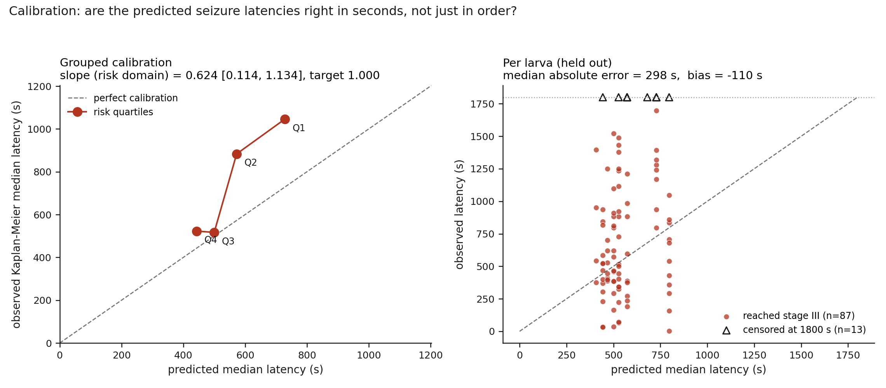

# Electrophysiological prediction of seizure susceptibility during the latent period after traumatic brain injury in larval zebrafish

**A survival analysis of latency to pentylenetetrazol-evoked stage III seizure following graded weight-drop injury, using local field potential markers of excitation–inhibition balance and critical slowing.**

*Analysis code, results, and figures. All numbers below are produced by `run_analysis.py` and stored in [`results/results.json`](results/results.json) with seeds, configuration, and package versions.*

---

## Abstract

**Background.** The interval between traumatic brain injury and the first unprovoked seizure — the latent period — is the only plausible window for anti-epileptogenic intervention, but there is no validated method for identifying which injured brains are epileptogenic. Injury severity, the standard triage variable, does not resolve the individual variation that defines the clinical problem.

**Methods.** One hundred larval zebrafish (6 dpf, five clutches) received a calibrated weight-drop injury at one of four heights (0, 27, 54, 108 cm; 25 per group), producing peak impact pressures of 0–290 kPa. Local field potentials were recorded 2.0–3.9 h post-injury and parameterized into aperiodic (`1/f`) components, critical slowing indicators, epileptiform discharge rate, and normalized band power. Larvae were then challenged with 15 mM pentylenetetrazol (PTZ) and scored blind for latency to stage III seizure, with a 1800 s observation window. Latency was modelled by elastic-net regularized Cox proportional hazards with clutch as a stratified baseline hazard. All scaling, hyperparameter tuning, and feature selection were performed inside leave-one-fish-out cross-validation folds, verified by a sentinel corruption test. Significance was assessed against a 1000-iteration permutation null in which the entire pipeline was refitted.

**Results.** Seizure latency shortened monotonically with injury dose (Kaplan–Meier median 1046 s in sham to 468 s at 108 cm). Adding the full electrophysiological feature set to impact pressure did not improve prediction (cross-validated concordance 0.583 → 0.574; Δ = −0.009, 95% CI −0.033 to +0.015; likelihood ratio χ²(9) = 13.33, *p* = 0.148). Both models exceeded their permutation nulls, the pressure-only model more decisively (*p* = 0.0010) than the model including electrophysiology (*p* = 0.022). Predicted susceptibility ordered the injury gradient almost perfectly (Spearman ρ = 0.947) yet failed entirely to discriminate larvae *within* an injury level (pair-weighted within-stratum concordance 0.413, below chance). Of four mechanistically prespecified markers, only the aperiodic exponent behaved as predicted (HR 0.46 per SD, 95% CI 0.22–0.97, *p* = 0.042; corroborated by an independent Weibull AFT fit, time ratio 1.81, *p* = 0.015). Both critical slowing indicators inverted, and did so in agreement with each other. All three baseline locomotor measures were largely restatements of injury dose (R² = 0.73–0.87 on impact pressure alone).

**Conclusion.** The model reproduces the injury gradient and cannot separate two larvae that sustained the same impact. The risk score is therefore a re-measurement of injury dose rather than a measure of individual seizure susceptibility. A single direction-correct electrophysiological signal — flattening of the aperiodic exponent, consistent with a shift toward excitation — survived every check and warrants dedicated investigation. This is a negative result that only becomes visible when overall discrimination is decomposed by injury stratum.

---

## 1. Background

### 1.1 The latent period is the therapeutic window

Traumatic brain injury is one of the few causes of acquired epilepsy with a known time of onset. A patient is injured on a given day; if post-traumatic epilepsy develops, the first unprovoked seizure typically follows months to years later. The intervening **latent period** is not a quiescent interval — it is the period during which the network is reorganising into an epileptic one, through interneuron loss, axonal sprouting, gliosis, and altered receptor expression.

This makes the latent period the only interval in which an *anti-epileptogenic* therapy — one that prevents the disease rather than suppressing established seizures — could act. Clinical trials of post-traumatic seizure prophylaxis have consistently failed to prevent epilepsy, and one contributing reason is straightforward: **trials cannot identify which injured patients are epileptogenic**, so they treat everyone. Most enrolled patients were never going to develop epilepsy, and any true treatment effect is diluted beyond detection.

### 1.2 Injury severity is a weak stratification variable

Severity of injury is the conventional triage variable and is a poor one. Two patients sustaining comparable measured impacts can follow entirely divergent trajectories, one recovering and the other developing refractory epilepsy. That divergence is the clinical fact this study addresses. If something other than the magnitude of the insult determines epileptogenesis, it should be observable in how the injured network behaves — and the local field potential is the most direct available window onto that.

### 1.3 Objective and prespecified hypotheses

The study tests one narrow, falsifiable question:

> **Does the injured brain's own electrophysiological signal, recorded hours after injury, carry information about seizure susceptibility beyond what impact severity already provides?**

Two nested models are compared: **M0**, containing impact pressure alone, and **M1**, containing impact pressure plus the full local field potential feature set. Four directional hypotheses were specified before modelling, each derived from an explicit mechanism (Section 2.9.6), so that a model achieving discrimination through biologically reversed coefficients can be identified as fitting noise.

---

## 2. Methods

### 2.1 Animals and experimental design

One hundred larval zebrafish were studied at **6 days post-fertilisation (dpf)**, a stage at which the forebrain is functional, GABAergic and glutamatergic transmission are established, and stereotyped seizure behaviour can be elicited and scored. All larvae were the same age; age therefore contributes no variance to this analysis.

The design is fully crossed and balanced:

| Factor | Levels | n per level |
|---|---|---|
| Injury condition | Sham, TBI 27 cm, TBI 54 cm, TBI 108 cm | 25 |
| Clutch (biological replicate) | A, B, C, D, E | 20 |
| Plate | P1–P5 (24-well) | 24, 24, 24, 24, 4 |

Each clutch contributed exactly five larvae to each of the four injury conditions, so **clutch is orthogonal to injury condition** and cannot confound the dose effect. Clutch is also distributed across plates (4–5 larvae per clutch per plate), so plate and clutch are not aliased. One larva occupies one well; one row of the dataset corresponds to one larva throughout, and this is asserted programmatically at load time.

### 2.2 Traumatic brain injury by calibrated weight drop

Injury was delivered by a **100 g weight** released from one of four heights — **0 cm (sham), 27 cm, 54 cm, and 108 cm** — approximately doubling the potential energy at each step. Drop weight was identical across all animals, so height is the sole manipulated injury parameter.

Delivered impact was measured directly as **peak pressure (`max_pressure_kPa`)** rather than inferred from height. Observed pressures were:

| Condition | Drop height | Peak pressure, mean ± SD (range) |
|---|---|---|
| Sham | 0 cm | 0.0 ± 0.0 kPa (all exactly 0.0) |
| TBI low | 27 cm | 112.8 ± 10.0 kPa (93.4–133.6) |
| TBI mid | 54 cm | 161.2 ± 14.3 kPa (136.7–190.0) |
| TBI high | 108 cm | 251.9 ± 22.0 kPa (217.9–290.3) |

Two features of this distribution matter for interpretation. First, measured pressure varies substantially *within* each injury group (SD 10–22 kPa), which is what makes within-stratum analysis meaningful for the injured groups. Second, **sham animals have identically 0.0 kPa with zero variance**, which makes impact pressure structurally unable to discriminate within the sham group — a constraint that recurs in Sections 4.6 and 4.9.

Impact pressure, not condition label, is used as the injury covariate throughout (see Section 2.8).

### 2.3 Local field potential recording

Local field potentials were recorded from each larva **2.02–3.88 h after injury (median 3.05 h)**, before any convulsant challenge. These are therefore measurements of the *resting injured network during the latent period*, not recordings of seizure activity.

The interval between injury and recording (`lfp_rec_time_h_post_injury`) varies across animals and is retained as a covariate rather than assumed irrelevant, so that any systematic drift in the electrophysiological measures with post-injury time can be absorbed rather than misattributed to injury severity. It is essentially uncorrelated with impact pressure (*r* = 0.10), confirming that recording order was not confounded with dose.

### 2.4 Electrophysiological feature extraction

Four families of feature were derived from each recording. Each rests on a distinct and independently motivated piece of neurophysiology.

#### 2.4.1 Aperiodic parameterization: excitation–inhibition balance

A field potential power spectrum comprises narrowband oscillatory peaks superimposed on a broadband, approximately `1/f` aperiodic background. The steepness of that background — the **aperiodic exponent** — is not measurement noise. Both biophysical modelling and empirical recording indicate that it tracks the ratio of excitatory to inhibitory synaptic currents in the underlying population.

The mechanism rests on a difference in synaptic kinetics: **AMPA-mediated excitatory currents decay rapidly, whereas GABA<sub>A</sub>-mediated inhibitory currents decay slowly.** A population under strong inhibitory control is dominated by slow currents, concentrating power at low frequencies and producing a steep spectral slope. A shift toward excitation increases the relative contribution of fast currents and **flattens** the spectrum.

Three parameters are extracted:

| Feature | Meaning |
|---|---|
| `lfp_ap_slope` | Aperiodic exponent. **Lower = flatter = shifted toward excitation.** Observed range 0.75–2.63. |
| `lfp_ap_offset` | Broadband vertical offset, related to aggregate population spiking. Range −0.85 to 0.29. |
| `lfp_ap_fit_error` | Goodness of fit of the aperiodic model. Retained as a covariate rather than discarded, so that poorly fitted spectra can be identified as such. Range 0.021–0.100. |

This is directly relevant to post-traumatic epileptogenesis because parvalbumin-positive fast-spiking interneurons are selectively vulnerable to traumatic injury. Their loss removes fast perisomatic inhibition, which should flatten the aperiodic exponent — a mechanistically specific, directionally testable prediction.

#### 2.4.2 Critical slowing indicators

The second family derives from dynamical systems theory rather than synaptic physiology. A system approaching a **bifurcation** — a threshold beyond which its current stable state ceases to exist — recovers from perturbation progressively more slowly. Two measurable consequences follow, and they are mathematically linked rather than independently postulated:

| Feature | Meaning |
|---|---|
| `lfp_variance_uV2` | Signal variance. **Rises** as perturbations are damped less effectively. Range 53–361 µV². |
| `lfp_autocorr_lag1` | Lag-1 autocorrelation. **Rises** as the system's present state increasingly resembles its recent past. Range 0.31–0.74. |

These are the canonical **early warning signals of critical transitions**. A seizure is a plausible candidate for such a transition — a network switching from asynchronous to hypersynchronous dynamics — so if the injured brain is drifting toward its seizure threshold during the latent period, both should rise together.

Because they arise from the *same* underlying slowdown, they constitute a built-in internal consistency check. Concordant movement is evidence about network dynamics; discordant movement indicates that at least one is tracking an artifact (electrode drift, movement, filtering) rather than approach to instability. This check is performed explicitly in Section 4.5.

#### 2.4.3 Epileptiform discharge rate

`lfp_discharge_rate_per_min` (range 0.07–1.66 min⁻¹) counts brief, high-amplitude paroxysmal deflections resembling interictal discharges. In clinical epileptology, interictal epileptiform activity is the classical electrographic marker of a hyperexcitable cortex, and its emergence during the post-traumatic latent period is among the more reproducible findings in the experimental literature.

#### 2.4.4 Normalized band power

`lfp_power_low_norm`, `lfp_power_mid_norm`, and `lfp_power_high_norm` describe the distribution of oscillatory power across three bands.

**These three variables are a closed composition:** they sum to 1.000 ± 0.0007 across all 100 larvae. Only two are independent, and the residual variation in their sum is rounding, not signal. This has a direct analytical consequence, addressed in Section 2.9.1.

### 2.5 Baseline locomotor phenotyping

Three measures of unstimulated swimming were acquired by video tracking before the convulsant challenge:

| Feature | Range |
|---|---|
| `beh_baseline_speed_mm_s` | 0.47–2.93 mm/s |
| `beh_baseline_immobile_frac` | 0.43–0.93 |
| `beh_baseline_burst_rate_per_min` | 2.14–12.22 min⁻¹ |

These are plausible susceptibility markers but are also directly downstream of the injury itself. They are therefore treated as **candidate confounds rather than predictors** and tested explicitly against impact pressure (Section 4.8) instead of being entered into the survival model.

### 2.6 Pentylenetetrazol challenge and endpoint scoring

All larvae received **pentylenetetrazol (PTZ) at 15 mM**, identical in concentration across the cohort.

The pharmacology is essential to interpreting the outcome. **PTZ is a GABA<sub>A</sub> receptor antagonist.** It does not induce seizure activity through a novel mechanism; it progressively removes inhibition at a fixed rate. Because every larva receives the same challenge, what differs between animals is not the perturbation but **how much GABAergic restraint each brain had in reserve when the challenge began**.

This reframes the endpoint. **Latency to seizure is not a behavioural score; it is a titration of inhibitory reserve.** A brain whose inhibitory tone is already eroded has less to lose and crosses into generalised seizure sooner. A brain with intact reserve absorbs the antagonist for longer. The seconds on the clock index a latent physiological quantity that cannot be measured directly.

The endpoint is **stage III** on the Baraban scale of PTZ-evoked behaviour in larval zebrafish, in which stage I is increased swimming activity, stage II is rapid whirlpool-like circling, and **stage III is loss of posture with a whole-body clonus-like convulsion**. Stage III is unambiguous and was used as the sole endpoint. **Scoring was blinded for all 100 larvae** (`scorer_blinded` = YES throughout).

Observation continued for **1800 s**. Eighty-seven larvae reached stage III within that window. **Thirteen did not**, and these are treated as **right-censored** — known to have survived beyond 1800 s with the remainder of their latency unobserved.

This is why survival analysis is required rather than classification. The censored animals are not failures and are not negatives: **they are the larvae with the greatest inhibitory reserve in the cohort**, and they carry more information about resilience than any other subgroup. Coding them as "did not seize" would discard that information and would additionally treat the arbitrary length of the observation session as though it were a property of the animal. `tests/test_data.py` enforces both invariants — that no censored larva is dropped, and that recoding censored animals as observed non-events materially changes the fit (confirming censoring genuinely enters the likelihood).

Censoring is **administrative and non-informative in mechanism**: every censored animal has exactly 1800 s recorded, and no observed event time reaches the horizon. Censoring is nonetheless unevenly distributed across dose (6 sham, 5 at 27 cm, 2 at 54 cm, 0 at 108 cm), which is itself a dose–response observation.

### 2.7 Quality control

Two quality metrics were recorded and are reported as diagnostics:

| Metric | Range | Interpretation |
|---|---|---|
| `lfp_clean_fraction` | 0.684–0.995 | Proportion of the recording surviving artifact rejection |
| `dlc_tracking_error_px` | 0.52–3.67 px | Pose-estimation error in video tracking |

**Neither is used as a predictor.** They describe the quality of the measurement, not the state of the animal; a model that uses them predicts the equipment. They appear in `results.json` under `qc` and nowhere else.

### 2.8 Variables excluded from modelling, with rationale

| Excluded | Reason |
|---|---|
| `condition` | A one-to-one relabelling of drop height. Including it would admit the experimental design itself as a predictor, letting the model recognise the group rather than characterise the animal. Drop height is used as a **stratum** — a quantity to hold constant and predict *within* — never as a feature. |
| `lfp_clean_fraction`, `dlc_tracking_error_px` | Quality control (Section 2.7). |
| `beh_baseline_*` | Tested against injury dose rather than modelled (Section 2.5). |
| `age_dpf`, `ptz_conc_mM`, `drop_weight_g`, `censor_time_s`, `scorer_blinded` | Constant across all 100 larvae; zero variance, zero information. Dropped explicitly and logged. |

### 2.9 Statistical analysis

#### 2.9.1 Survival model specification

Latency to stage III was modelled by **Cox proportional hazards regression with an elastic-net penalty**, minimising the penalized negative Breslow log partial likelihood:

```
−ℓ(β) + n·λ·[ α·Σⱼ wⱼ|βⱼ| + ½(1−α)·Σⱼ wⱼβⱼ² ]
```

with λ (penalty strength) and α (L1 ratio) tuned within each fold over λ ∈ {0.001, 0.01, 0.03, 0.1, 0.3, 1.0} and α ∈ {0.1, 0.5, 0.9, 1.0}. Regularization is required because 11 correlated predictors against 87 events is a regime in which unpenalized coefficients are unstable; it is also the mechanism by which each feature is required to earn inclusion.

Two specification decisions follow directly from the biology and the data structure:

**Impact pressure is left unpenalized** (*w* = 0 for `max_pressure_kPa`). The central comparison asks whether the electrophysiological signal adds information *beyond injury severity*; if the penalty were permitted to delete the injury term, that comparison could be won by discarding the reference rather than by improving on it.

**Unpenalized fits drop one power band as a compositional reference.** Because the three normalized bands sum to unity (Section 2.4.4), the design matrix attains full rank only through rounding noise, and an unpenalized fit diverges chasing it. `lfp_power_high_norm` is therefore dropped from all unpenalized fits (likelihood ratio test, Schoenfeld residuals, Weibull AFT) and this is recorded in the results file. Penalized fits retain all three, since the ridge component identifies them.

Predictors were standardized within each training fold, so hazard ratios are reported **per standard deviation** of each feature across the cohort, with the raw-unit SD recorded alongside.

#### 2.9.2 Handling of clutch

Five clutches of siblings do not share a common baseline seizure threshold; genetic background and maternal contribution shift it. Clutch therefore enters as a **stratified baseline hazard**, permitting each clutch its own baseline hazard function while sharing covariate effects. This is precisely the biological claim being made.

A gamma-frailty term was preferred a priori. `lifelines` 0.30.3 implements no frailty Cox model, and its cluster-robust sandwich estimator cannot be combined with stratification (raises `KeyError`; verified). The variance correction that frailty would have supplied is therefore obtained by **bootstrapping whole clutches** (2000 resamples), so that the unit of resampling is the biological replicate rather than the individual larva. This substitution is logged verbatim in `results.json` under `diagnostics.frailty_substitution`.

#### 2.9.3 Cross-validation and leakage control

Performance was estimated by **leave-one-fish-out cross-validation** (100 folds). Within each fold, the standardization constants, the inner hyperparameter search, and the elastic-net feature selection were all refitted from scratch on the 99 remaining larvae before the held-out animal was scored. Hyperparameters were selected by the **cross-validated partial likelihood** criterion (Verweij & van Houwelingen) over 5 event-balanced inner folds, which remains defined when an inner fold contains few events.

This is enforced rather than asserted. Three independent mechanisms:

1. **Structural.** `FoldPipeline` records the row indices it was fitted on and raises `LeakageError` if asked to score any of them. Deliberate in-sample scoring (the final full-data model) must declare itself explicitly.
2. **Sentinel canary.** `tests/test_leakage.py` replaces the held-out larvae's covariates and outcomes with extreme values (~10⁶), refits, and asserts that **every** training-fold scaling constant, selected hyperparameter, selected feature set, and coefficient is bit-identical. A companion test applies the same corruption to *training* rows and asserts the fingerprint *does* change, so the canary cannot pass vacuously.
3. **Audit trail.** Every fit/predict pair is logged; the reported run recorded **504 pairs with zero violations**.

#### 2.9.4 Permutation inference

Every concordance index is reported against a **1000-iteration permutation null**. In each iteration the (latency, event) pair is shuffled across larvae **as a unit**, so a censored animal remains censored and merely becomes attached to different covariates, and the **entire pipeline is refitted end to end** — standardization, inner tuning, selection, and all 100 outer folds. Nothing is cached from the observed fit. *p*-values use the add-one estimator (Phipson & Smyth), so a permutation *p* is never reported as exactly zero.

Confidence intervals for concordance indices are percentile bootstrap intervals resampling **whole clutches**, consistent with Section 2.9.2.

#### 2.9.5 Model diagnostics

The proportional hazards assumption was tested using **Schoenfeld residuals** with a rank time transform, per covariate and globally. The analysis plan specified that a violation would trigger refitting as a **Weibull accelerated failure time** model with the switch logged. The global test was not significant (Section 4.11), so the Cox model was retained; the Weibull AFT fit was nonetheless computed and is reported as a sensitivity analysis, with effects expressed as time ratios.

The **events-per-predictor ratio** is computed and flagged against a threshold of 10.

#### 2.9.6 Prespecified directional hypotheses

Discrimination achieved through biologically reversed coefficients indicates fitting of noise, not measurement of susceptibility. Each mechanistic feature therefore carries a direction specified in advance, in `pte/config.py`, together with its rationale:

| Feature | Predicted | Mechanism |
|---|---|---|
| `lfp_ap_slope` | **HR < 1** | Flattening indexes a shift toward excitation; a *lower* exponent should shorten latency |
| `lfp_variance_uV2` | **HR > 1** | Critical slowing; rising variance should shorten latency |
| `lfp_autocorr_lag1` | **HR > 1** | Critical slowing; rising autocorrelation should shorten latency |
| `lfp_discharge_rate_per_min` | **HR > 1** | Greater interictal-like activity indicates a more irritable network |

A hazard ratio within 1% of unity per SD (|log HR| < 0.01) is classified as carrying **no direction**, rather than as agreeing. Reading the sign of a coefficient the penalty has already deleted would manufacture agreement from rounding, and this classification is enforced in `tests/test_questions.py`.

#### 2.9.7 Software and reproducibility

Python 3.14.4 with `lifelines` 0.30.3, `numpy` 2.4.4, `pandas` 2.3.3, `scipy` 1.17.1, `matplotlib` 3.10.9. Exact versions, all random seeds, and the full configuration are written into `results.json` under `provenance`.

All **reported estimates** — hazard ratios, confidence intervals, likelihood ratio tests, Schoenfeld residuals, Weibull AFT — are produced by `lifelines`. The cross-validation and permutation machinery is driven by a purpose-built proximal-Newton elastic-net Cox solver (`pte/coxnet.py`, ~2 ms per fit), because a `lifelines` penalized fit at ~190 ms would place 1000 end-to-end permutation refits at several weeks of computation. `tests/test_equivalence.py` asserts agreement between the two to within 0.01 on the log-hazard scale across the entire hyperparameter grid, stratified and unstratified. The complete reported run required 3.8 h, almost entirely permutation refitting.

### 2.10 Protocol parameters not recoverable from the dataset

For completeness and honest reporting, the following are **not** recorded in `latent_fish_data.xlsx` and cannot be reconstructed from it. They are stated here as an explicit gap rather than inferred, and should be completed from the laboratory record before publication:

- Strain/background, rearing temperature, light cycle, and embryo medium composition
- Anaesthesia, immobilisation, and mounting protocol for electrophysiology
- Electrode type and placement, amplifier, sampling rate, and filter settings
- Artifact-rejection criteria underlying `lfp_clean_fraction`
- Spectral estimation parameters and the fitting range and algorithm used for aperiodic parameterization
- Frequency edges defining the low, mid, and high power bands
- Amplitude and duration thresholds defining an epileptiform discharge
- Recording arena dimensions, camera frame rate, tracking software and model, and the speed threshold defining immobility and bursts
- PTZ vehicle, application volume, and exact time from application to the start of observation
- Institutional animal ethics approval identifiers

---

## 3. Model framework


---

## 4. Results

### 4.1 Cohort and censoring

One hundred larvae; **87 reached stage III**, **13 right-censored** at 1800 s. No tied event times. The events-per-predictor ratio for M1 is **7.91**, below the conventional minimum of 10, and is flagged in the output. Individual hazard ratios are accordingly reported as directional evidence rather than as precise effect sizes.

### 4.2 Seizure latency shortens monotonically with injury dose

| Condition | n | Events | Censored | Kaplan–Meier median latency |
|---|---|---|---|---|
| Sham | 25 | 19 | 6 | **1046 s** |
| TBI 27 cm | 25 | 20 | 5 | **884 s** |
| TBI 54 cm | 25 | 23 | 2 | **573 s** |
| TBI 108 cm | 25 | 25 | 0 | **468 s** |

The weight-drop model produces a clear, graded reduction in the PTZ dose needed to provoke generalised seizure — a **55% reduction in median latency** from sham to the highest injury level, with censoring falling from 6 animals to none. The injury manipulation worked, and inhibitory reserve is depleted in proportion to the impact. Everything that follows concerns whether anything *beyond* this dose effect can be detected.

### 4.3 The electrophysiological signal adds nothing beyond impact severity

Cross-validated concordance was **0.583 (95% CI 0.518–0.651)** for impact pressure alone and **0.574 (0.522–0.628)** with the full electrophysiological set added — a change of **−0.009 (95% CI −0.033 to +0.015)**. Adding ten features made prediction marginally worse. The nested likelihood ratio test concurs: **χ²(9) = 13.33, *p* = 0.148**.

The elastic net reached the same conclusion independently. Across the 100 folds, impact pressure was retained **100 times out of 100**; the most frequently retained electrophysiological feature, `lfp_ap_slope`, survived **16 times**, discharge rate 14, and all others 8 or fewer. In the final model every electrophysiological coefficient is shrunk to effectively zero, leaving impact pressure alone at **HR 1.48 per SD (1.25–1.94)**.

### 4.4 Permutation null


| Model | Observed *c* | Null mean | Null 95th pct | *p* | *z* |
|---|---|---|---|---|---|
| **M0** (pressure only) | 0.583 | 0.458 | 0.532 | **0.0010** | +1.82 |
| **M1** (pressure + LFP) | 0.574 | 0.468 | 0.559 | **0.022** | +1.56 |

Both models exceed their null, and **the pressure-only model does so more decisively than the model containing the brain signal.**

Both null distributions centre **below** 0.5 (0.458 and 0.468) rather than on it — expected for a cross-validated concordance under a tuned, selected model, and the reason a nominal chance line at 0.500 is the wrong reference. Judged against 0.5 these models appear worse than they are; judged against a null that ignored the tuning they would appear better.

What this licenses is narrow. It establishes that the association between predictors and latency is not an artifact of the fitting procedure. It says nothing about *which* association, and Sections 4.6 and 4.9 establish that the association detected is the between-group injury contrast. **A permutation *p* of 0.022 and a within-stratum concordance of 0.413 are not in conflict — they are the same result viewed from two directions.**

### 4.5 Prespecified directions: one of four holds

Because the penalty deleted the electrophysiological block, direction is assessed in the unpenalized sensitivity fit:

| Feature | Predicted | Observed HR per SD (95% CI) | *p* | Verdict |
|---|---|---|---|---|
| `lfp_ap_slope` | HR < 1 | **0.46 (0.22–0.97)** | **0.042** | **Confirmed** |
| `lfp_discharge_rate_per_min` | HR > 1 | 1.04 (0.70–1.55) | 0.85 | Correct sign, negligible |
| `lfp_variance_uV2` | HR > 1 | **0.78 (0.56–1.09)** | 0.15 | **Inverted** |
| `lfp_autocorr_lag1` | HR > 1 | **0.98 (0.59–1.63)** | 0.95 | **Inverted** |

The aperiodic exponent behaves exactly as the excitation–inhibition account predicts, and is the only feature in the unpenalized fit whose interval excludes 1 — impact pressure itself does not, once the electrophysiological block is in the model (HR 0.97, 0.65–1.45, *p* = 0.89). **A one-SD flattening of the aperiodic exponent is associated with approximately a doubling of seizure hazard.** The independent Weibull AFT fit agrees (time ratio **1.81 per SD, *p* = 0.015**: a steeper exponent buys 81% more latency).

### 4.6 The two critical slowing indicators agree with each other, and both point the wrong way

`lfp_variance_uV2` (HR 0.78) and `lfp_autocorr_lag1` (HR 0.98) agree in sign, and the underlying features are genuinely correlated across larvae (*r* = 0.67; Spearman ρ = 0.67, *p* = 2 × 10⁻¹⁴). They co-vary as the shared-slowdown mechanism requires — **but both point away from seizure risk rather than toward it.**

Two mechanistically linked markers failing in the same direction is not two independent failures; it is one shared cause. The most parsimonious interpretation is that both track a post-traumatic shift toward slower, higher-amplitude, more strongly damped network activity, which raises variance and autocorrelation without moving the network closer to its seizure bifurcation. Critical slowing theory requires proximity to a tipping point for these markers to carry their intended meaning; nothing in this dataset establishes that the injured larval brain is in that regime 2–4 h post-injury.

### 4.7 Larvae that sustained the same impact are not distinguishable

This is the question injury severity cannot answer, and the clinically decisive one. Holding drop height constant, pair-weighted within-stratum concordance is **0.413 — below chance** — and no stratum has an interval excluding 0.5:

| Drop height | n | Events | Within-stratum *c* (95% CI) |
|---|---|---|---|
| 0 cm | 25 | 19 | 0.163 (0.044–0.314) |
| 27 cm | 25 | 20 | 0.528 (0.353–0.693) |
| 54 cm | 25 | 23 | 0.522 (0.350–0.718) |
| 108 cm | 25 | 25 | 0.430 (0.267–0.588) |

Independent elastic-net refits *within* each stratum are also reported in `results.json`, but rest on 19–25 events against up to 11 predictors (events per predictor 1.8–2.3) and are explicitly labelled descriptive rather than inferential.

### 4.8 Predicted susceptibility tracks the injury gradient almost perfectly

| Condition | Mean predicted risk score (95% CI) |
|---|---|
| Sham | −0.556 (−0.596 to −0.517) |
| TBI 27 cm | −0.064 (−0.099 to −0.028) |
| TBI 54 cm | +0.149 (+0.093 to +0.205) |
| TBI 108 cm | +0.491 (+0.438 to +0.543) |

Ordering is monotone exactly as expected, with **Spearman ρ = 0.947** between drop height and predicted risk (*p* = 4 × 10⁻⁵⁰).

**Sections 4.7 and 4.8 read together constitute the principal finding.** The model reproduces the injury gradient near-perfectly and cannot separate two larvae within a gradient step at all. Taken together, these establish that the risk score is not a measure of susceptibility — **it is a re-measurement of the dose.** The model has learned the injury axis, which was never in question, and has learned nothing about the individual-variation axis, which is the entire clinical problem.

### 4.9 Baseline behaviour is a restatement of injury dose

| Feature | R² on impact pressure alone (95% CI) | *r* | Independent variance |
|---|---|---|---|
| `beh_baseline_speed_mm_s` | **0.871** (0.813–0.911) | +0.93 | 13% |
| `beh_baseline_burst_rate_per_min` | **0.849** (0.784–0.896) | +0.92 | 15% |
| `beh_baseline_immobile_frac` | **0.728** (0.623–0.808) | −0.85 | 27% |

Between 73% and 87% of each behavioural marker is a restatement of impact severity. Excluding them from the survival model was correct.

**One prior expectation is not supported.** The stated premise was that injury suppresses locomotion. In this cohort baseline speed **rises** with impact pressure (*r* = +0.93) and immobile fraction **falls** (*r* = −0.85) — post-injury hyperactivity rather than hypoactivity. The redundancy conclusion is unaffected, but the direction of the underlying relationship is opposite to the one assumed, and this is recorded explicitly in `results.json` rather than absorbed silently.

### 4.10 The model does not transfer to an unseen injury level

Trained on three drop heights and tested on the fourth, discrimination is indistinguishable from chance in all three evaluable strata:

| Held-out stratum | Events | *c* (95% CI) |
|---|---|---|
| 27 cm | 20 | 0.521 (0.368–0.692) |
| 54 cm | 23 | 0.495 (0.356–0.646) |
| 108 cm | 25 | 0.510 (0.379–0.651) |
| 0 cm (sham) | 19 | **Undefined** — see below |

The sham stratum could not be scored. With impact pressure the only surviving predictor and pressure identically 0.0 kPa across all 25 sham larvae, every held-out animal received an **identical risk score**. Concordance there is **undefined, not at chance**; reporting 0.500 would have been an artifact of ties presented as a measurement. This is Section 4.7 seen from another angle: remove the between-group contrast and nothing remains.

### 4.11 Calibration



Ranking substantially outperforms absolute timing. The calibration slope in the risk domain is **0.624 (95% CI 0.114–1.134)** against a target of 1.0. In the time domain, regressing observed on predicted log-latency yields a slope of **0.240** and intercept **4.69** — a slope near zero indicates predicted latency barely tracks observed latency. Median absolute error is **298 s**, mean signed bias **−110 s**, against an 1800 s observation window.

The grouped curve shows the failure mode directly: predicted medians span only **443–729 s** across risk quartiles while observed Kaplan–Meier medians span **523–1046 s**. **The model compresses the range**, systematically over-predicting risk for resilient larvae and under-predicting it for vulnerable ones.

### 4.12 Diagnostics

| Diagnostic | Result |
|---|---|
| Schoenfeld global test | χ²(10) = 8.65, ***p* = 0.565** — proportional hazards holds |
| Per-covariate flags | `lfp_power_mid_norm` only (*p* = 0.031); unremarkable across ten tests |
| Model switch | **Not triggered**; Cox retained. Weibull AFT reported as sensitivity analysis |
| Leakage audit | 504 fit/predict pairs, **0 violations** |
| Events per predictor | **7.91 — flagged** (threshold 10) |
| Bootstrap convergence | 2000/2000 clutch resamples converged |

---

## 5. Discussion

### 5.1 A single marker survived

The aperiodic exponent behaved as the excitation–inhibition account predicts, produced the only confidence interval in the study excluding no effect, and did so consistently under two different model families (Cox proportional hazards and Weibull accelerated failure time). This is internally coherent: post-traumatic loss of inhibitory control, visible in the broadband spectrum hours after injury, tracks how much inhibitory reserve remains for PTZ to titrate away. Given the selective vulnerability of parvalbumin-positive interneurons to traumatic injury, a flattened aperiodic exponent is the spectral signature one would predict from the known cellular pathology.

This remains a single result in 100 animals with 87 events and an events-per-predictor ratio below the conventional threshold. It should be treated as a hypothesis meriting a dedicated, adequately powered experiment — ideally with the aperiodic exponent as the sole prespecified primary endpoint — not as an established biomarker.

### 5.2 The critical slowing markers failed informatively

Variance and lag-1 autocorrelation did not fail randomly. They agreed with each other and inverted together, which localises the cause to something shared rather than to independent noise in either measurement. This is more useful than either succeeding ambiguously: it indicates that the assumption licensing their use — that the network is near a bifurcation at the time of recording — is not satisfied at 2–4 h post-injury in this preparation. Whether it becomes satisfied at a later point in the latent period is a testable question this dataset cannot address, since the LFP was sampled once.

### 5.3 The model learned the dose axis, not the susceptibility axis

The central negative result is the juxtaposition of Sections 4.7 and 4.8. A model that orders injury groups at ρ = 0.947 and discriminates within groups at *c* = 0.413 has not learned about seizure susceptibility; it has learned about impact pressure, which was already measured directly by the pressure gauge.

**The clinical problem was never to distinguish a severe impact from a mild one.** It was to determine which of two comparably injured brains is undergoing epileptogenesis. On that question this cohort returns a clear negative.

### 5.4 Implications for the design of biomarker studies

This result is only visible because overall discrimination was decomposed by injury stratum. A single reported concordance of **0.574 against a 1000-permutation null at *p* = 0.022** would conventionally be reported as weak but genuine predictive signal, and would have been. Decomposed, it is between-group separation with nothing inside the groups — and the diagnostic giveaway is that removing the electrophysiological block entirely makes the permutation result *stronger* (*p* = 0.0010), not weaker.

Two practices are worth generalising. First, **stratified evaluation should be routine** in any study where a dose or severity gradient is present, because a global discrimination metric will otherwise be dominated by the gradient. Second, **prespecified directional hypotheses cost nothing and catch a specific failure mode** — a model with good discrimination and inverted biology, which is indistinguishable from a good model by performance metrics alone.

---

## 6. Limitations

1. **Events per predictor is 7.91**, below the conventional minimum of 10. Individual coefficients are variance-limited; hazard ratios are reported as directional evidence.
2. **A single PTZ concentration at a single time point.** One 15 mM challenge yields one point on a dose–response curve; inhibitory reserve is inferred from a single titration.
3. **The LFP was recorded once, 2–4 h post-injury.** The latent period is unsampled beyond this window, and whether these markers evolve over it is untested here.
4. **Sham larvae have exactly 0.0 kPa**, giving zero within-group variance in the strongest predictor and rendering the sham stratum structurally unable to answer the within-stratum question.
5. **The three normalized power bands are a closed composition**, so only two are independent and unpenalized fits require a reference category.
6. **Cross-sectional design.** No larva was followed to spontaneous recurrent seizures, which is the actual definition of epilepsy. PTZ-evoked latency is a susceptibility assay, not a diagnosis of epileptogenesis.
7. **Protocol parameters listed in Section 2.10 are absent from the dataset** and must be supplied from the laboratory record for the methods to be fully reproducible.

---

## 7. Data and code availability

### 7.1 Repository structure

```
latent_fish_data.xlsx          one row per larva, n = 100
pte/
  config.py                    seeds, feature sets, prespecified directions
  data.py                      loading and censoring invariants
  coxnet.py                    elastic-net Cox solver (CV / permutation engine)
  pipeline.py                  fold-local scaling, tuning, selection + leakage guard
  cv.py                        leave-one-fish-out cross-validation
  inference.py                 hazard ratios, Schoenfeld residuals, Weibull AFT
  permutation.py               1000-iteration null, refit end to end
  questions.py                 the eight prespecified analyses
  report.py, plots.py          results.json, metrics.csv, figures
tests/
  test_leakage.py              sentinel canary + audit trail
  test_data.py                 censored larvae never dropped or recoded
  test_equivalence.py          coxnet vs lifelines agreement
  test_questions.py            reporting logic for directions and intervals
results/
  results.json                 all metrics, CIs, diagnostics, seeds, versions
  metrics.csv                  flat metrics table
  fig_null_distribution.png    permutation null
  fig_calibration.png          calibration
docs/model_framework.png       Figure 1
```

### 7.2 Reproduction

```bash
pip install -r requirements.txt
python run_analysis.py
```

Runtime is approximately 3.8 h, almost entirely the 1000 end-to-end permutation refits. For a rapid pass:

```bash
python run_analysis.py --permutations 50 --bootstrap 500
```

Verification of the leakage guards, survival-data invariants, solver equivalence, and reporting logic (70 tests):

```bash
python -m pytest tests/ -v
```

Regenerate Figure 1:

```bash
python make_framework_figure.py
```

---

## 8. Key references

**Preparation and endpoint**
- Baraban SC, Taylor MR, Castro PA, Baier H (2005). Pentylenetetrazole induced changes in zebrafish behavior, neural activity and c-fos expression. *Neuroscience* 131:759–768. *(Stage I–III scale used here.)*

**Clinical motivation**
- Annegers JF, Hauser WA, Coan SP, Rocca WA (1998). A population-based study of seizures after traumatic brain injuries. *New England Journal of Medicine* 338:20–24.
- Temkin NR (2009). Preventing and treating posttraumatic seizures: the human experience. *Epilepsia* 50(Suppl 2):10–13.
- Pitkänen A, Engel J Jr (2014). Past and present definitions of epileptogenesis and its biomarkers. *Neurotherapeutics* 11:231–241.

**Aperiodic exponent and excitation–inhibition balance**
- Gao R, Peterson EJ, Voytek B (2017). Inferring synaptic excitation/inhibition balance from field potentials. *NeuroImage* 158:70–78.
- Donoghue T, Haller M, Peterson EJ, et al. (2020). Parameterizing neural power spectra into periodic and aperiodic components. *Nature Neuroscience* 23:1655–1665.

**Critical slowing and critical transitions**
- Scheffer M, Bascompte J, Brock WA, et al. (2009). Early-warning signals for critical transitions. *Nature* 461:53–59.
- Scheffer M, Carpenter SR, Lenton TM, et al. (2012). Anticipating critical transitions. *Science* 338:344–348.

**Statistical methods**
- Cox DR (1972). Regression models and life-tables. *Journal of the Royal Statistical Society B* 34:187–220.
- Zou H, Hastie T (2005). Regularization and variable selection via the elastic net. *Journal of the Royal Statistical Society B* 67:301–320.
- Simon N, Friedman J, Hastie T, Tibshirani R (2011). Regularization paths for Cox's proportional hazards model via coordinate descent. *Journal of Statistical Software* 39:1–13.
- Verweij PJM, van Houwelingen HC (1993). Cross-validation in survival analysis. *Statistics in Medicine* 12:2305–2314.
- Grambsch PM, Therneau TM (1994). Proportional hazards tests and diagnostics based on weighted residuals. *Biometrika* 81:515–526.
- Harrell FE Jr, Lee KL, Mark DB (1996). Multivariable prognostic models. *Statistics in Medicine* 15:361–387.
- Peduzzi P, Concato J, Feinstein AR, Holford TR (1995). Importance of events per independent variable in proportional hazards regression analysis. *Journal of Clinical Epidemiology* 48:1503–1510.
- Phipson B, Smyth GK (2010). Permutation P-values should never be zero. *Statistical Applications in Genetics and Molecular Biology* 9:39.
